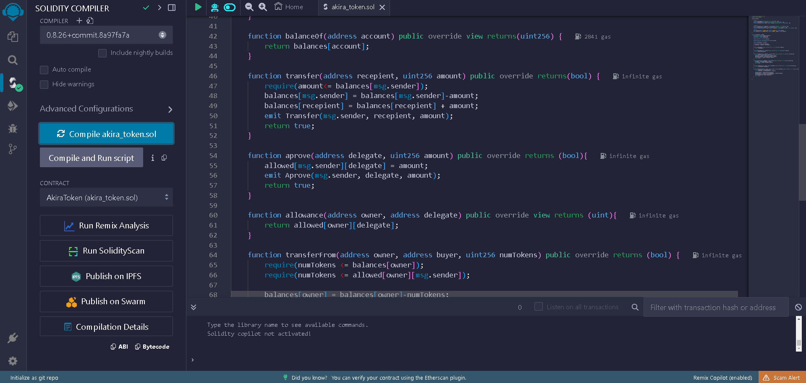
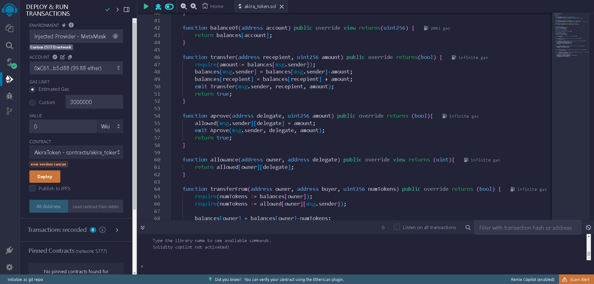
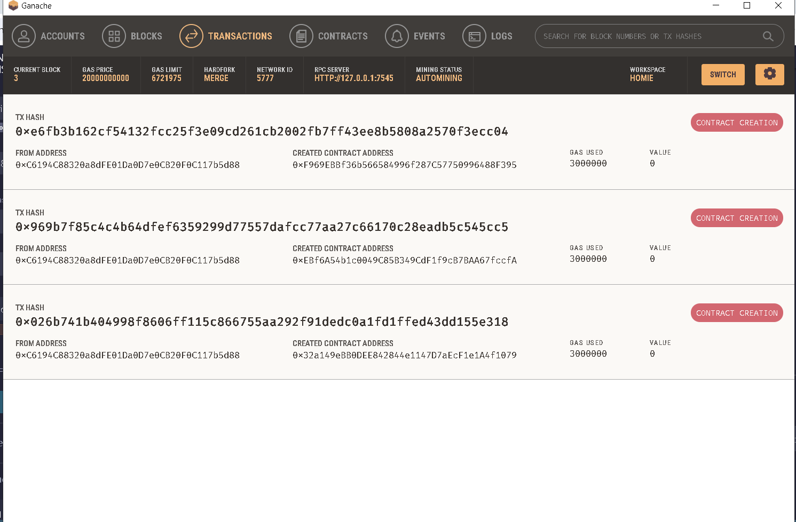

# Projeto de Token ERC20

## Objetivo
O objetivo do projeto é fazer um token com o padrão erc20 com **solidity 0.8.0** sendo testado com a ferramenta **ganache** e **metamask**

Primeiramente foi se declarada uma interface com nome ERC20 para garantir que os contratos que a implementassem seguisse o padrão corretamente.

## Testes
Após a implementação do codigo na ide do remix compilei o codigo para executalo no ganache

Após isso conectei a metamask e o ganache com a chave privada de uma conta teste do ganache.

Por fim conectei o plugin da metamask no remix.

Após isso fiz deploy do contrato
